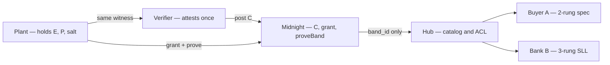
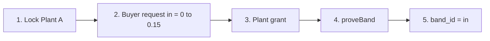
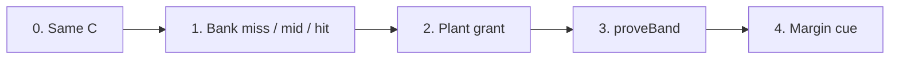

# Caplock — PRD (hackathon)

Date: 2026-09-08
Hackathon: Midnight Korea 2026 (submit by 2026-09-28 00:00 KST)
Working title: **Caplock**
Form: hybrid request hub + Midnight check engine (not a carbon market)

This document is the product requirements brief. It replaces
`2026-09-08-caplock-design.md` as the product direction. That earlier note is
kept as background on K-ETS vocabulary only.

Editable architecture boards (Cursor / VS Code Excalidraw extension, or
[excalidraw.com](https://excalidraw.com)):

- [`docs/superpowers/diagrams/caplock-architecture.excalidraw`](../diagrams/caplock-architecture.excalidraw)
  — three frames: shared hybrid, Track A, Track B

PNG previews of those frames:

- [Shared hybrid](../diagrams/caplock-shared-hybrid.png)
- [Track A — buyer](../diagrams/caplock-track-a-buyer.png)
- [Track B — bank](../diagrams/caplock-track-b-bank.png)

---

## 1. One sentence

A plant attests one period once. A buyer and a bank each post **their own
ladder**. Midnight answers **which rung**. Nobody receives the workbook.

## 2. Problem

### 2.1 What is real

Industrial plants already send a **fat book** to government (Korea: K-ETS
statement with site, fuel, **production volume**, emissions). The public NGMS
row is thin. Commercial counterparties are a third door.

Those counterparties will not take “we met the requirement.” Plants will not
send activity data (`E` emissions, `P` production, recipe, utilization). When
they do send a file, buyers waste time cleaning dirty, incomparable
spreadsheets.

The requirement is almost never a global A–E stamp. It is **the
counterparty’s own scale**:

- **Track A — buyer / offtake:** a purchase spec. “Intensity ≤ my max, this
  method, this period.” Two rungs: in spec / out of spec. Over the line is
  off-spec (reject, discount, or no green premium).
- **Track B — bank / SLL:** a facility grid. “Miss / mid / hit” on this loan’s
  KPI (LMA/LSTA ratchets). Three or more rungs. Outcome is margin, not goods.

A single cap is a ladder with two rungs. We design for the **ladder**.

### 2.2 What we do not pretend

- Counterparties do **not** price off NGMS. Government and commercial tracks
  are parallel.
- CSR / CBAM / many SLLs still need a **number** to add, tax, or put in an
  assurance file. This product answers a **gate**, not a tax calculator.
- Midnight does not measure. Unattested or wrong-method data is garbage in,
  valid-looking proof. The verifier still looks once at the door.
- Ports already run ESI / Green Award on **ships**. Out of hackathon scope.

### 2.3 Unique value

Not “we fit every domain.” The value is the **check**:

> Custom ladder in. Rung out. No workbook. The hub never sees the tonnes.

Midnight is why the hub is allowed to exist without becoming another data
hostage. Domain travel (buyer and bank on one lock) is a property, not the
pitch.

## 3. Why Midnight

A public chain or a normal portal can store a grade. It cannot let a third
party **check a private pair** without seeing it.

| Layer | Job | Midnight? |
|---|---|---|
| Measure | Meters, period totals | No — plant |
| Attest | Verifier confirms `(E, P, method)` | No — human / auditor, then posts a hash |
| Check | Does that lock sit in **this** request’s bands? | **Yes** |
| Disclose | Only `band_id` or `none` | **Yes** |

Compact: no division. Intensity `E/P` in band `[L, H)` is
`E * H_den >= L_num * P` and `E * H_den < H_num * P` with scaled integers
(same as the earlier design note).

If the request names method M and the lock was attested under method N, the
circuit must fail. A yes on the wrong recipe is a lie.

## 4. Scope

### 4.1 In (hackathon)

- One industrial plant (steel or similar) and one attested period.
- Two requester types on the **same** lock: buyer (A) and bank (B).
- Hybrid hub: compose request, grant access, read `band_id`.
- Midnight: commitment `C`, request hash, grant, prove → `band_id`.
- Fixtures: Plant A in-spec / bank hit; Plant B out / bank miss; fake opening
  fails.
- README: problem in one line, how to run, what is private, how Midnight is
  used.

### 4.2 Out

- K-ETS / NGMS replacement, KAU/KOC/KRX.
- CBAM levy math, Scope 3 rollup.
- Port / ship scores.
- Live unaudited feeds, replacing Big-4 SLL assurance letters.
- Global public A–E registry (LESS, IEA labels).
- SME “we never measured” — fail closed.

### 4.3 Open (only after the core prove is green)

- Preprod + hosted hub URL.
- Extra disclosed field `scheme = intensity` (still no `E`/`P`).
- More than two requesters on one lock.

## 5. Users and expected usage

| Actor | Does | Sees |
|---|---|---|
| **Verifier** | Checks the period off-chain; posts `C = hash(E, P, salt, plantId, period, methodId)` | Real pair (once) |
| **Plant** | Holds the same witness; grants who may request this `C`; runs prove | Own form (local) |
| **Buyer (A)** | Files a 2-rung spec request; reads `in` or `none` | Rung only |
| **Bank (B)** | Files a 3-rung SPT request; reads `miss` / `mid` / `hit` | Rung only |
| **Hub** | Identity, request catalog, ACL UX | Request text, grants, result pointer — never witness |
| **Midnight** | Stores `C`, request hash, grant, result | Not plain `E`/`P` |

Happy path (one lock, two gates):

1. Verifier and plant agree off-chain on Plant A, 2025, method `kets-intensity-v1`,
   `E=120000`, `P=1000000` (scaled), salt.
2. Verifier posts `C`. Status `locked`.
3. Buyer posts request R_buy: bands `in = [0, 0.15)`, else out. Plant grants
   buyer on this `C`. Prove → `in`.
4. Bank posts request R_sll: `miss [0.18, ∞)`, `mid [0.15, 0.18)`,
   `hit [0, 0.15)`. Plant grants bank. Prove → `hit`.
5. Neither screen shows 120 or 1000.

Lie path: prove with `E=1`, `P=10000` → hash ≠ `C` → reject, no rung.

Over-cap path: Plant B locked over the buyer’s `0.15` → buyer `none`, bank
`miss`.

## 6. Request object (always a ladder)

```text
VerifyRequest
  requesterId
  subject        plantId
  period         e.g. 2025 or 2025Q1
  methodId       must match the lock
  bands[]        { id, lowNumer, lowDenom, highNumer, highDenom }  // [low, high)
```

- One cap = two conceptual rungs: the listed `in` band, and implicit `none`.
- SLL grid = three (or more) explicit ids.
- Response: `band_id` or `none`. Never `E`, `P`, or exact intensity.

Access: prove is allowed only if the plant granted `(requesterId, C, requestHash)`.

## 7. Architecture (hybrid hub)

Recommended over “everything in Compact” (painful UX) and “hub-only”
(another portal that sees or holds dirt).

The editable board is the Excalidraw file above (three frames: shared
architecture, Track A, Track B). Open it in the Cursor / VS Code Excalidraw
extension, or drag it onto [excalidraw.com](https://excalidraw.com). GitHub
renders the mermaid copies below.

```text
Verifier attests period  →  posts C on Midnight
                                │
Requester  →  Hub: create request (ladder + method + period)
                                │
Plant      →  Hub: grant this requester on this C
                                │
Prove      →  Midnight: witness + public (C, request hash)
                                │
Hub reads  →  band_id | none
```







| Piece | Holds | Must not hold |
|---|---|---|
| Plant / verifier | `E`, `P`, salt, method notes | — |
| Hub | Request JSON, ACL, result pointer | Witness |
| Midnight | `C`, request hash, grant, `band_id` | Plain `E`, `P` |

Circuits (units):

- `lock` — verifier only. Store `C`, `methodId`, `status=locked`. No `E`/`P`.
- `grant` — plant. Bind requester + request hash to this `C`.
- `proveBand` — plant (or anyone with the opening, for the demo). Check
  `hash == C`, method match, locate the unique band. `disclose(band_id)`.
- Read is off-chain / hub: `{ plantId, period, requester, methodId, band_id }`.

Error handling:

- No lock / not granted / method mismatch / hash fail / `P = 0` → transaction
  fails. No `band_id` written.
- Overlapping bands in a request → reject at hub (invalid request), never
  prove.

## 8. Form (what we ship)

Three surfaces, no marketplace:

| Route | Actor | Shows | Actions |
|---|---|---|---|
| `/plant` | Verifier + plant | Period, method, E, P, salt (local) | Lock, grant |
| `/buyer` | Buyer | Their ladder, result rung | Create request A |
| `/bank` | Bank | Their ladder, result rung | Create request B |

Copy on buyer and bank pages: **not shown** — emissions, production, exact
intensity.

Local undeployed: Node 22, Docker, proof server `http://127.0.0.1:6300`.

## 9. Hackathon success

Judges can run: lock A → buyer `in` + bank `hit`; fake numbers fail; lock B →
buyer `none` + bank `miss`. README states the ministry still gets the
statement; counterparties get a rung.

## 10. Fixtures

| Plant | E (scaled tCO2e) | P (scaled t) | Buyer cap 0.15 | Bank miss ≥ 0.18 / mid / hit [0, 0.15) |
|---|---|---|---|---|
| A | 120000 | 1000000 | `in` (0.12) | `hit` (below 0.15) |
| B | 200000 | 1000000 | `none` (0.20) | `miss` (at or above 0.18) |

## 11. Sources (desk research, not interviews)

- K-ETS statement includes production; NGMS public row is thinner
  ([IEEJ](https://eneken.ieej.or.jp/data/11487.pdf),
  [시행령 제39조](https://govbrief.kr/scan/011712/39/),
  [탄소중립기본법 시행령 제23조](https://govbrief.kr/scan/014255/23/)).
- Scope 3 / PCF sharing blocked by trade secrets
  ([npj Climate Action](https://www.nature.com/articles/s44168-023-00032-x)).
- Buyer offtake: max intensity as a product spec
  ([OIES hydrogen offtake](https://www.oxfordenergy.org/wpcms/wp-content/uploads/2025/08/ET50-Hydrogen-Offtake-Agreements.pdf),
  [SSBP near-zero cap](https://rmi.org/news/amazon-and-johnson-controls-join-major-corporations-in-launching-tender-to-accelerate-deployment-of-near-zero-emissions-steel/)).
- SLL: annual (or trigger-date) verification; LMA count-of-SPTs and LSTA
  blended target/threshold grids
  ([SLLP](https://www.lma.eu.com/application/files/2317/4481/8026/Sustainability-Linked_Loan_Principles_-_26_March_2025_.pdf),
  [Hogan Lovells](https://www.hlc.com/en/publications/slls-recent-oversight-developments-and-comparing-the-lma-lsta-and-aplma-approaches)).
- Existing portals share a **number** under contract (TfS, Catena-X, SiGREEN),
  not a hub-blind rung.
