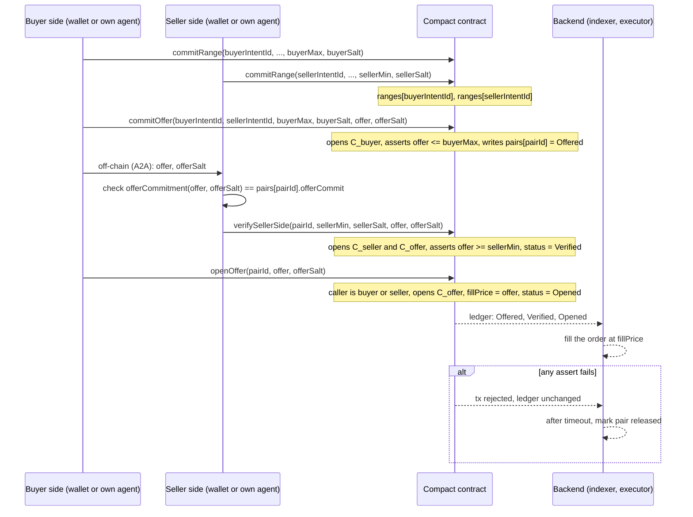
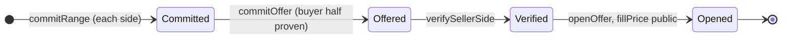

# Intent Compact contract spec

Date: 2026-09-18, revised 2026-09-20, amended 2026-09-20 (sections 2, 4, 5, 6, 7 to 10, 13, 14, 16)
Hackathon: Midnight Korea 2026
Status: implemented in contract/, amended after final review
Design source: [Discussion #10](https://github.com/sdh2222/midnight-hackathon/discussions/10), agreed 2026-09-20
Product source: [Private Intent Execution MVP PRD](./2026-09-08-caplock-prd.md). Sections 5, 6, 8, and 10 of the PRD will be updated to match this spec once the contract interface lands.

This document is the Compact contract interface. It does not implement frontend, AI parsing, agents, or HTTP APIs.

The reference implementation is contract/src/intent.compact. Where this document and the source disagree, the source governs and this document is corrected.

## 1. One sentence

Each side commits its own price limit, the buyer commits one offer that is proven to sit under the buyer's limit, the seller proves the same offer sits above the seller's limit, and only then is the offer opened on the ledger as the fill price.

## 2. What is agreed (Discussion #10)

- Midnight is the verifier. The application indexes the ledger and executes orders. It never decides overlap or picks a price.
- There is no range overlap check. `buyerMax >= sellerMin` is never proven as a statement. It follows from the two half proofs on the same offer.
- Each half is proven by its owner against their own commitment. No party and no server holds both limits at the same time.
- `buyerMax`, `sellerMin`, every salt, and the offer before open never enter an API request, the database, or the ledger in plaintext.
- A failed check is an `assert`. The transaction is rejected and the ledger does not change. Nothing about a failed offer is written anywhere.
- The offer is opened only after both halves passed and the trade is going to settle.
- One range commit per wallet per item. One offer per (buyer, seller) pair. A closed pair never reopens.
- Amounts are KRW integers (won). No division, no strings inside commitments.
- Range and offer commitments carry a domain tag. Two commitments to the same value with the same salt never produce the same hash.
- `openOffer` may be called only by the buyer or the seller of the pair. Holding the opening is not enough.

## 3. Changes from the Discussion #10 circuit list

Discussion #10 listed five circuits with `verifyBuyerSide` as its own step. This spec folds the buyer's half into `commitOffer`. Reasons:

- The buyer knows `offer` and `buyerMax` at commit time. A separate transaction adds nothing.
- With a separate step, a buyer could commit an offer above their own limit, let the seller prove `offer >= sellerMin`, and learn that bit without ever being bound by their own range. Proving the buyer's half at commit time closes that.
- The seller then only ever proves against an offer that is already inside the buyer's range.

Circuits are therefore four: `commitRange`, `commitOffer`, `verifySellerSide`, `openOffer`. The state machine and the privacy properties are unchanged.

## 4. Flow





`Committed` is not a ledger status. It means both `ranges` rows exist. `released` is an application status set after a timeout with no Verified or Opened event. It has no ledger write in the MVP.

## 5. Types (JSON to Compact)

String IDs never enter the contract. The client SHA-256s the UTF-8 string and passes `Bytes<32>`. Do not put `Opaque<"string">` inside `persistentCommit`.

| JSON field | Compact type | Public on ledger | Notes |
|---|---|---|---|
| `intentId`, `itemId` | `Bytes<32>` | yes | SHA-256 of the JSON string |
| `pairId` | `Bytes<32>` | yes | `persistentHash([buyerIntentId, sellerIntentId])`, derived inside the circuit |
| `role` | `enum Role { Buyer, Seller }` | yes | |
| `quantity` | `Uint<32>` | yes | must be `> 0` |
| `currency` | `enum Currency { KRW }` | yes | MVP is KRW only |
| `version` | `Uint<32>` | yes | approved version |
| `owner` | `Bytes<32>` | yes | `ownPublicKey().bytes` at commit |
| `buyerMax`, `sellerMin` | `Uint<64>` | never | won |
| `offer` | `Uint<64>` | only as `fillPrice` after `openOffer` | won |
| `salt`, `offerSalt` | `Bytes<32>` | never | random per commitment |

Commitments:

```text
C_range = persistentCommit<[Uint<8>, Uint<64>]>([1, limit], salt)
C_offer = persistentCommit<[Uint<8>, Uint<64>]>([2, offer], offerSalt)
```

The first tuple element is a domain tag: `1` for a range commitment, `2` for an offer commitment. Without it, a buyer who reused a salt and offered exactly `buyerMax` would publish two equal hashes, and anyone comparing `ranges[buyerIntentId].commitment` with `pairs[pairId].offerCommit` would learn `offer == buyerMax` before open. With the tag the two hashes differ even for the same value and the same salt. Salts must still be fresh random bytes per commitment; the tag is defense in depth, not a substitute.

The contract exports `rangeCommitment(limit, salt)` and `offerCommitment(offer, offerSalt)` as pure circuits. Wallets and the backend compute commitments through them (`pureCircuits.rangeCommitment` in the generated module) and never reimplement the encoding. Their return value is the hash only; the inputs stay private.

The public fields of an intent live in the ledger row next to the commitment, so they do not need to be inside it. A commitment can only be opened by the holder of the salt, so a copied hash is useless to anyone else.

## 6. Ledger

```text
struct RangeRecord {
  owner:      Bytes<32>              # ownPublicKey().bytes
  role:       Role
  itemId:     Bytes<32>
  quantity:   Uint<32>
  currency:   Currency
  version:    Uint<32>
  commitment: Bytes<32>          # C_range
}

enum PairStatus { Offered, Verified, Opened }

struct PairRecord {
  buyerIntentId:  Bytes<32>
  sellerIntentId: Bytes<32>
  offerCommit:    Bytes<32>      # C_offer
  status:         PairStatus
  fillPrice:      Uint<64>       # 0 until Opened
}

export ledger ranges:     Map<Bytes<32>, RangeRecord>   # key intentId
export ledger ownerItems: Set<Bytes<32>>                # key persistentHash([owner, itemId])
export ledger pairs:      Map<Bytes<32>, PairRecord>    # key pairId
```

Three pure helpers are exported so the backend, wallets, and tests never reimplement a hash:

```text
export circuit pairIdOf(buyerIntentId: Bytes<32>, sellerIntentId: Bytes<32>): Bytes<32>
  = persistentHash<Vector<2, Bytes<32>>>([buyerIntentId, sellerIntentId])
export circuit rangeCommitment(limit: Uint<64>, salt: Bytes<32>): Bytes<32>
  = persistentCommit<[Uint<8>, Uint<64>]>([1, limit], salt)
export circuit offerCommitment(offer: Uint<64>, offerSalt: Bytes<32>): Bytes<32>
  = persistentCommit<[Uint<8>, Uint<64>]>([2, offer], offerSalt)
```

They read and write nothing. The four state-changing circuits below are the contract's interface.

`RangeRecord` has no limit field. `PairRecord` has no limit field and `fillPrice` is zero until open.

Safe to read on chain: intent ids, pair ids, owner keys, role, itemId hash, quantity, currency, version, status, `fillPrice` after open.

Must never appear on chain or in a circuit return: `buyerMax`, `sellerMin`, any salt, `offer` before open, raw NL intent.

## 7. Circuit `commitRange`

Caller: the user's own wallet or agent, once per approved intent.

**Args:** `intentId`, `role`, `itemId`, `quantity`, `currency`, `version`, `limit`, `salt`
Public: the first six. Private: `limit`, `salt`.

**Assert:**

- `quantity > 0`
- `limit > 0`
- `ranges` has no row for `intentId`
- `ownerItems` does not contain `persistentHash([ownPublicKey().bytes, itemId])` (rule: one range commit per wallet per item)

**Effect:**

```text
ranges[intentId] = {
  owner: ownPublicKey().bytes, role, itemId, quantity, currency, version,
  commitment: rangeCommitment(limit, salt)
}
ownerItems.insert(persistentHash([ownPublicKey().bytes, itemId]))
```

No overwrite. A user who wants a different limit for the same item needs a new wallet. That is the price of blocking limit probing, and it is intended.

Writing the public fields to the ledger needs Compact `disclose(...)`. That is a compiler rule and does not make `limit` public. `limit` and `salt` are never passed to `disclose`.

## 8. Circuit `commitOffer`

Caller: the buyer, once per (buyer, seller) pair. This circuit carries the buyer's half proof.

**Args:** `buyerIntentId`, `sellerIntentId`, `buyerMax`, `buyerSalt`, `offer`, `offerSalt`
Public: the two ids. Private: the rest.

**Derived:** `pairId = persistentHash([buyerIntentId, sellerIntentId])`

**Assert:**

- `ranges` has rows for both ids
- buyer row `role == Buyer`, seller row `role == Seller`
- `itemId`, `quantity`, `currency` equal on both rows
- `ownPublicKey() == buyerRow.owner`
- `rangeCommitment(buyerMax, buyerSalt) == buyerRow.commitment`
- `offer > 0`
- `offer <= buyerMax`
- `pairs` has no row for `pairId` (rule: one offer per pair, a closed pair never reopens)

**Effect:**

```text
pairs[pairId] = {
  buyerIntentId, sellerIntentId,
  offerCommit: offerCommitment(offer, offerSalt),
  status: Offered,
  fillPrice: 0
}
```

After the transaction lands, the buyer's agent sends `(offer, offerSalt)` to the seller's agent over the A2A channel. That message is off-chain and never goes through the backend API.

## 9. Circuit `verifySellerSide`

Caller: the seller, after receiving `(offer, offerSalt)`. Before sending, the seller side should check locally that `offerCommitment(offer, offerSalt)` equals `pairs[pairId].offerCommit`. The circuit checks it again; the local check only saves a wasted transaction.

**Args:** `pairId`, `sellerMin`, `sellerSalt`, `offer`, `offerSalt`
Public: `pairId`. Private: the rest.

**Assert:**

- `pairs` has a row for `pairId` and `status == Offered`
- `sellerRow = ranges[pair.sellerIntentId]` exists
- `ownPublicKey() == sellerRow.owner`
- `rangeCommitment(sellerMin, sellerSalt) == sellerRow.commitment`
- `offerCommitment(offer, offerSalt) == pair.offerCommit`
- `offer >= sellerMin`

**Effect:** `pairs[pairId].status = Verified`

Nothing about `offer` or `sellerMin` is written. If `offer < sellerMin`, the seller cannot build a valid proof, and a forced transaction dies at the assert. The pair stays `Offered` on the ledger and the application marks it `released` after the timeout.

## 10. Circuit `openOffer`

Caller: the buyer or the seller of the pair. Both hold the opening. Call when the trade is going to settle. Nobody else may open the pair, even with the opening in hand.

**Args:** `pairId`, `offer`, `offerSalt`
Public: `pairId`. Private: `offer`, `offerSalt`.

**Assert:**

- `pairs` has a row for `pairId` and `status == Verified`
- `buyerRow = ranges[pair.buyerIntentId]` and `sellerRow = ranges[pair.sellerIntentId]` exist
- `ownPublicKey() == buyerRow.owner` or `ownPublicKey() == sellerRow.owner`
- `offerCommitment(offer, offerSalt) == pair.offerCommit`

**Effect:**

```text
pairs[pairId].fillPrice = disclose(offer)
pairs[pairId].status    = Opened
```

The caller check runs before the opening check. A third party who somehow holds `(offer, offerSalt)` is refused before the contract looks at the opening, so a leaked A2A message cannot be used to force `Opened` at a time the parties did not choose.

This is the only place `disclose` touches a price. The demo may call `openOffer` right after `verifySellerSide`. The step stays separate so that in a real flow the reveal is tied to settlement, not to verification.

## 11. Probing rules and where they are enforced

| Rule | Enforced by |
|---|---|
| One range commit per (wallet, item) | `ownerItems` set in `commitRange` |
| One offer per (buyer, seller) pair | `pairs` key check in `commitOffer` |
| Offer only after both ranges exist | `ranges` lookups in `commitOffer` |
| Offer must be inside the buyer's own range before the seller sees it | buyer half in `commitOffer` |
| Retry with a new value only against a new counterpart | follows from the two rules above |
| Deposit on commit, locked for a period | OPEN, Phase 2 (see section 15) |

What still leaks: one bit per offer (the seller either proved or did not). The buyer also learns nothing about the seller's limit beyond that bit. Comparing two limits with nobody holding both is out of scope.

## 12. Backend status mapping

The backend indexes `ranges` and `pairs`. It holds the mapping from JSON string ids to `Bytes<32>` hashes. It never receives a limit, a salt, or an offer before open.

| API status | Ledger condition |
|---|---|
| `committed` | both `ranges` rows exist |
| `offered` | `pairs[pairId].status == Offered` |
| `verified` | `pairs[pairId].status == Verified` |
| `opened` | `pairs[pairId].status == Opened`, `fillPrice > 0` |
| `released` | `Offered` with no `Verified` within timeout `T`. Application only. |
| `rejected` | a `commitRange` or `commitOffer` transaction was refused by an `assert`. No ledger change. |

There is no `verification_failed` row. A failed half proof leaves the pair `Offered` and the timeout turns it into `released`.

## 13. Demo fixtures

Amounts in won.

- **Hit:** `buyerMax 1000000`, `sellerMin 800000`, `offer 900000`. `commitOffer` passes (`900000 <= 1000000`), `verifySellerSide` passes (`900000 >= 800000`), `openOffer` writes `fillPrice 900000`.
- **Low offer:** same ranges, `offer 750000`. `commitOffer` passes, `verifySellerSide` cannot be proven. Pair stays `Offered`, then `released`. `750000` is never on the ledger or in the backend.
- **No overlap:** `buyerMax 700000`, `sellerMin 800000`. Any offer that passes `commitOffer` is `<= 700000`, so `verifySellerSide` always fails. An offer of `850000` fails at `commitOffer` itself.
- **Re-offer:** a second `commitOffer` for the same pair is refused on the `pairs` key check.
- **Tamper:** `openOffer` with `950000` fails on `offerCommit`. `verifySellerSide` with a `sellerMin` that does not open `C_seller` fails on `commitment`.
- **Privacy:** a ledger read of `ranges` and `pairs` never contains a limit, and `fillPrice` is `0` until `Opened`.
- **Third-party open:** `openOffer` from a wallet that is neither buyer nor seller, with the correct opening, is refused on the caller check. Pair stays `Verified`, `fillPrice` stays `0`.
- **Salt reuse:** the buyer commits `buyerMax 1000000` with salt `s`, then offers `1000000` with the same salt `s`. `ranges[buyerIntentId].commitment != pairs[pairId].offerCommit`, so the ledger does not reveal `offer == buyerMax`.

## 14. Implementation notes (next change, not this file)

- Toolchain: install the `compact` developer tool, run `compact update 0.34.0` (language 0.26.0, runtime 0.19.0; CI asserts both), and pin `pragma language_version >= <compact compile --language-version>`. Pin `@midnight-ntwrk/compact-runtime` to the exact value of `compact compile --runtime-version`. Unit tests compile with `--skip-zk`; ZK keys are only needed for deployment.
- Implementation plan: [2026-09-20-intent-contract.md](../plans/2026-09-20-intent-contract.md).
- No division, no strings, no `Opaque` inside commitments.
- `ownPublicKey()` binds each range to the key that committed it. If wallet integration is too heavy for the demo, the user's agent key is the owner. Drop the owner check only as a last resort, and then enforce the one-commit-per-item rule in the agent.
- Circuit arguments are private by default. Only ledger writes need `disclose`. Audit every `disclose` call: the allowed set is the public intent fields, the two intent ids, `pairId`, the return hash of the three pure helpers, and `fillPrice` in `openOffer`.

## 15. OPEN, Phase 2

Kept here so they are not lost. None of these are in the MVP.

- **Deposit:** a small coin on `commitRange` and `commitOffer`, refunded on `Opened` or after timeout. Needs Zswap `receive` and `send` and a `release` circuit. Makes wallet-per-probe cost real.
- **On-chain release:** a `release(pairId)` circuit gated by `kernel.blockTimeGreaterThan(offeredAt + T)`, so `released` becomes a ledger status and the deposit can be returned. MVP uses an application-side timeout instead.
- **Band discovery:** a `proveBand` circuit where each user proves alone that their limit lies in a coarse public band. Lets a marketplace view show relevant counterparts without any two-party comparison. Needs `ranges` indexed by `itemId`.
- **Seller-initiated offers:** allow the seller to be the offering side. Symmetric to sections 8 and 9.

## 16. Handoff

1. After approve, the user's wallet or agent calls `commitRange` with `limit` and `salt` as private inputs. The backend receives only the transaction hash and the public fields.
2. The buyer calls `commitOffer` with `buyerMax`, `buyerSalt`, `offer`, `offerSalt` private. Then the buyer agent sends `(offer, offerSalt)` to the seller agent off-chain.
3. The seller calls `verifySellerSide` with `sellerMin`, `sellerSalt`, `offer`, `offerSalt` private.
4. The buyer or the seller calls `openOffer` at settlement. No other wallet can.
5. Hash string ids with SHA-256 to `Bytes<32>` before every call. The backend keeps the mapping.
6. The only on-chain results the UI needs are `pairs[pairId].status` and `pairs[pairId].fillPrice`.
7. Compute every commitment with `pureCircuits.rangeCommitment` / `pureCircuits.offerCommitment` from the generated module. Never hand-roll the hash. Use a fresh 32-byte random salt for every commitment.
