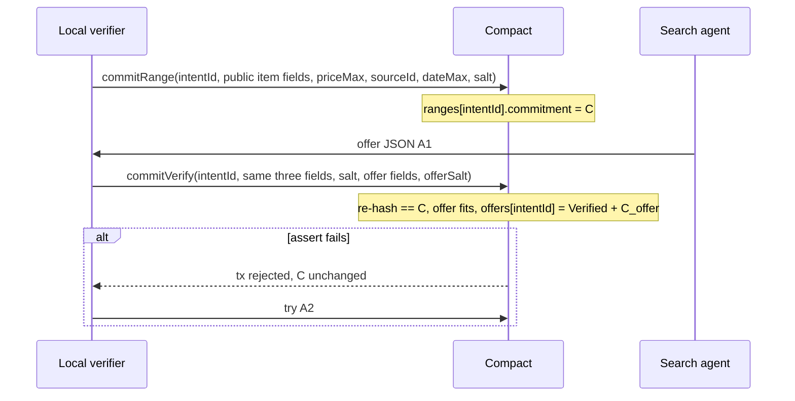
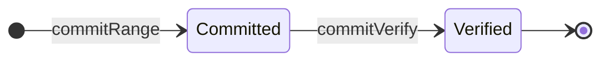

# Intent Compact contract spec

Date: 2026-09-18, revised 2026-09-21 (marketplace buyer-only amend)
Hackathon: Midnight Korea 2026
Status: interface for `contract/src/intent.compact`
Design source: [2026-09-21-marketplace-local-verify.md](./2026-09-21-marketplace-local-verify.md), figures `intent_01` / `intent_02`
Supersedes: Discussion #10 A2A four-circuit pair (`commitOffer`, `verifySellerSide`, `openOffer`, seller `commitRange`). Those circuits are not in this interface. Phase 2 rows in section 15 stay listed OPEN.

This document is the Compact contract interface. It does not implement frontend, AI parsing, agents, or HTTP APIs.

The reference implementation is `contract/src/intent.compact`. Where this document and the source disagree, the source governs and this document is corrected.

## 1. One sentence

Company A locks a three-field criteria hash on Midnight. A local verifier later re-hashes the same preimage and, in the same transaction, checks that a marketplace offer fits and writes `C_offer`.

## 2. What is agreed

- Midnight is the verifier. The search agent does not match another agent. It gathers marketplace offers as JSON and never sees the criteria preimage.
- `commitRange` is the T0 lock. It is not a search key.
- `commitVerify` is the only later Midnight call. It re-hashes `priceMax`, `sourceId`, `dateMax`, and `salt` and checks equality with the locked `C`. It does not decrypt `C`.
- In that same transaction, if the offer fits, the circuit writes `C_offer` and `status = Verified`.
- A failed check is an `assert`. The transaction is rejected and `C` does not change.
- One range commit per wallet per item. First successful verify binds that `intentId`. A second verify reverts.
- Amounts are KRW integers (won). No division, no strings inside commitments.
- Range and offer commitments carry a domain tag so the two hashes never coincide.
- `commitVerify` may be called only by the owner of the T0 row.
- Zero `sourceId` (32 zero bytes) or zero `dateMax` means unconstrained at verify. Those zeros are still inside `C`.

## 3. Changes from the A2A circuit list

Discussion #10 and the 2026-09-18 four-circuit pair assumed a seller also `commitRange`’d on Midnight. The locked product is marketplace search. Seller-on-chain circuits are out of this interface.

Circuits are two impure plus two pure helpers: `commitRange`, `commitVerify`, `rangeCommitment`, `offerCommitment`.

Replaced (not this flow; not deleted from history): `commitOffer` as a pair circuit, `verifySellerSide`, `openOffer`, `pairIdOf`, seller `commitRange`.

## 4. Flow





`Committed` is not a ledger status. It means the `ranges` row exists.

## 5. Types (JSON to Compact)

String IDs never enter the contract. The client SHA-256s the UTF-8 string and passes `Bytes<32>`.

| JSON field | Compact type | Public on ledger | Notes |
|---|---|---|---|
| `intentId`, `itemId` | `Bytes<32>` | yes | SHA-256 of the JSON string |
| `quantity` | `Uint<32>` | yes | must be `> 0` |
| `currency` | `enum Currency { KRW }` | yes | MVP is KRW only |
| `version` | `Uint<32>` | yes | approved version |
| `owner` | `Bytes<32>` | yes | `ownPublicKey().bytes` at commit |
| `priceMax` | `Uint<64>` | never | won, must be `> 0` |
| `sourceId` | `Bytes<32>` | never | SHA-256 of a normalized source string; 32 zeros = unconstrained at verify |
| `dateMax` | `Uint<32>` | never | unix day; `0` = unconstrained at verify |
| `offerPrice` | `Uint<64>` | never | won; not disclosed |
| `offerSource` | `Bytes<32>` | never | |
| `offerDate` | `Uint<32>` | never | unix day |
| `salt`, `offerSalt` | `Bytes<32>` | never | random per commitment |

Commitments:

```text
C = persistentCommit<[Uint<8>, Uint<64>, Bytes<32>, Uint<32>]>([1, priceMax, sourceId, dateMax], salt)
C_offer = persistentCommit<[Uint<8>, Uint<64>, Bytes<32>, Uint<32>]>([2, offerPrice, offerSource, offerDate], offerSalt)
```

The first tuple element is a domain tag: `1` for criteria, `2` for an offer. The contract exports `rangeCommitment` and `offerCommitment` as pure circuits. Wallets compute commitments through `pureCircuits` and never reimplement the encoding.

## 6. Ledger

```text
struct RangeRecord {
  owner:      Bytes<32>
  itemId:     Bytes<32>
  quantity:   Uint<32>
  currency:   Currency
  version:    Uint<32>
  commitment: Bytes<32>          # C
}

enum OfferStatus { Verified }

struct OfferRecord {
  offerCommit: Bytes<32>         # C_offer
  status:      OfferStatus
}

export ledger ranges:     Map<Bytes<32>, RangeRecord>   # key intentId
export ledger ownerItems: Set<Bytes<32>>                # key persistentHash([owner, itemId])
export ledger offers:     Map<Bytes<32>, OfferRecord>   # key intentId
```

```text
export circuit rangeCommitment(priceMax: Uint<64>, sourceId: Bytes<32>, dateMax: Uint<32>, salt: Bytes<32>): Bytes<32>
export circuit offerCommitment(offerPrice: Uint<64>, offerSource: Bytes<32>, offerDate: Uint<32>, offerSalt: Bytes<32>): Bytes<32>
```

Safe to read on chain: intent ids, owner keys, itemId hash, quantity, currency, version, `C`, `C_offer`, `status`.

Must never appear on chain or in a circuit return: `priceMax`, `sourceId`, `dateMax`, any salt, offer fields.

## 7. Circuit `commitRange`

Caller: the local verifier wallet, once per approved intent.

**Args:** `intentId`, `itemId`, `quantity`, `currency`, `version`, `priceMax`, `sourceId`, `dateMax`, `salt`  
Public: the first five. Private: the rest.

**Assert:**

- `quantity > 0`
- `priceMax > 0`
- `ranges` has no row for `intentId`
- `ownerItems` does not contain `persistentHash([ownPublicKey().bytes, itemId])`

**Effect:**

```text
ranges[intentId] = {
  owner: ownPublicKey().bytes, itemId, quantity, currency, version,
  commitment: rangeCommitment(priceMax, sourceId, dateMax, salt)
}
ownerItems.insert(persistentHash([ownPublicKey().bytes, itemId]))
```

No overwrite. A user who wants different criteria for the same item needs a new wallet.

## 8. Circuit `commitVerify`

Caller: the owner of `ranges[intentId]`. One success binds the intent.

**Args:** `intentId`, `priceMax`, `sourceId`, `dateMax`, `salt`, `offerPrice`, `offerSource`, `offerDate`, `offerSalt`  
Public: `intentId`. Private: the rest.

**Assert:**

- `ranges` has a row for `intentId`
- `ownPublicKey().bytes == row.owner`
- `rangeCommitment(priceMax, sourceId, dateMax, salt) == row.commitment`
- `offerPrice > 0`
- `offerPrice <= priceMax`
- if `sourceId` is not 32 zero bytes, `offerSource == sourceId`
- if `dateMax != 0`, `offerDate <= dateMax`
- `offers` has no row for `intentId`

**Effect:**

```text
offers[intentId] = {
  offerCommit: offerCommitment(offerPrice, offerSource, offerDate, offerSalt),
  status: Verified
}
```

## 9. Probing rules and where they are enforced

| Rule | Enforced by |
|---|---|
| One range commit per (wallet, item) | `ownerItems` in `commitRange` |
| One verified offer per intent | `offers` key check in `commitVerify` |
| Verify only after a range exists | `ranges` lookup in `commitVerify` |
| Same criteria as T0 | re-hash equals `C` |
| Deposit on commit | OPEN, Phase 2 (section 15) |

## 10. Backend status mapping

| API status | Ledger condition |
|---|---|
| `committed` | `ranges[intentId]` exists |
| `verified` | `offers[intentId].status == Verified` |
| `rejected` | a transaction was refused by an `assert`. No ledger change. |

There is no public fill price. The 발주서 uses the Verified transaction hash.

## 11. Demo fixtures

Amounts in won. Source and date zero unless noted.

- **Hit:** lock `1,500,000`, offer A1 `1,200,000`. `commitVerify` writes Verified and `C_offer`.
- **Over cap:** same lock, A2 `1,800,000`. Assert `offer above buyer limit`. `C` unchanged. No `offers` row.
- **Wrong preimage:** A1 with a different `priceMax` or `salt`. Assert re-hash mismatch.
- **Third-party verify:** another wallet, correct preimage and A1. Assert caller is not the owner.
- **Re-verify:** second `commitVerify` on the same `intentId` after a hit. Assert already bound.
- **Source lock:** non-zero `sourceId` at T0, different `offerSource`. Assert source mismatch. Zero `sourceId` accepts any `offerSource`.
- **Privacy:** a ledger read never contains `priceMax`, salts, or offer fields.

## 12. Implementation notes

- Toolchain: `compact update 0.34.0` (language 0.26.0, runtime 0.19.0). Pin `@midnight-ntwrk/compact-runtime` to `0.19.0`. Tests compile with `--skip-zk`.
- No division, no strings, no `Opaque` inside commitments.
- Circuit arguments are private by default. Audit every `disclose`: public intent fields, `intentId`, `itemId`, owner, and the return hashes of the two pure helpers.

## 13. OPEN, Phase 2

Kept here so they are not lost. None of these are in the MVP.

- **Deposit:** a small coin on `commitRange` and `commitVerify`, refunded on `Verified` or after timeout. Needs Zswap `receive` and `send` and a `release` circuit. Makes wallet-per-probe cost real.
- **On-chain release:** a `release(intentId)` circuit gated by `kernel.blockTimeGreaterThan(committedAt + T)`, so `released` becomes a ledger status and the deposit can be returned. MVP uses an application-side timeout instead.
- **Band discovery:** a `proveBand` circuit where each user proves alone that their limit lies in a coarse public band. Lets a marketplace view show relevant counterparts without any two-party comparison. Needs `ranges` indexed by `itemId`.
- **Seller-initiated offers:** allow the seller to be the offering side on Midnight. Symmetric to a seller-owned lock. Not this marketplace-buyer flow.
- **Public fill price:** an `openOffer` that `disclose`s the offer after `Verified`. MVP stamps the 발주서 with the Verified tx hash only.
- **A2A pair (superseded MVP):** `commitOffer` + `verifySellerSide` + seller `commitRange` + `pairIdOf`, as shipped before this amend. Kept so a later seller wallet can reuse the idea. Not implemented in the current `intent.compact`.

## 14. Handoff

1. After approve, the local verifier calls `commitRange` with the three criteria fields and `salt` private. The backend receives only the transaction hash and the public fields.
2. The search agent receives public JSON only and returns offer JSON.
3. The local verifier calls `commitVerify` with the T0 preimage from local storage and the chosen offer.
4. Hash string ids with SHA-256 to `Bytes<32>` before every call.
5. Compute commitments with `pureCircuits.rangeCommitment` / `pureCircuits.offerCommitment`. Fresh 32-byte salt every commitment.
6. UI reads `offers[intentId].status`.
