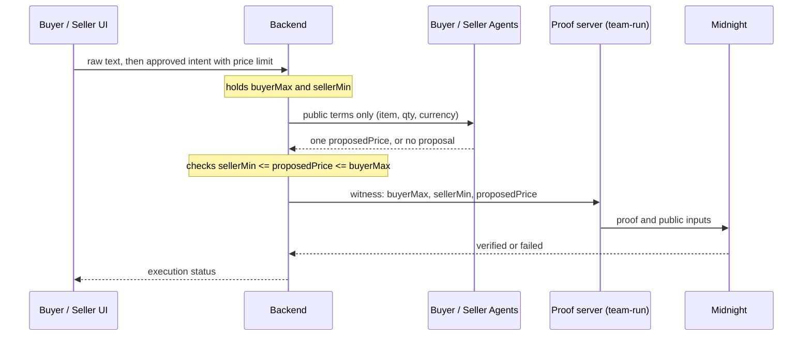
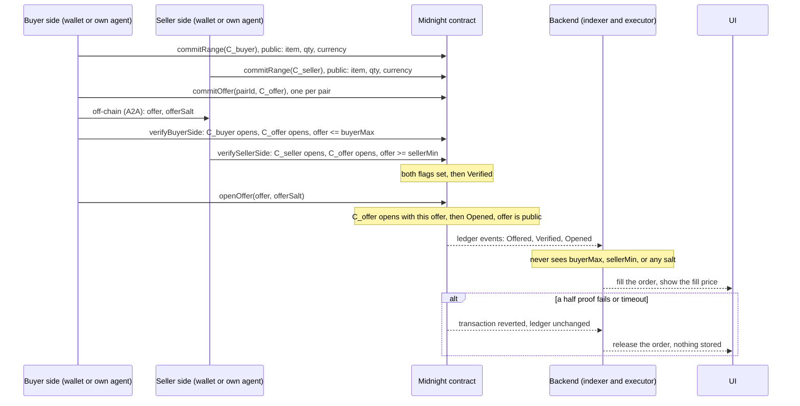
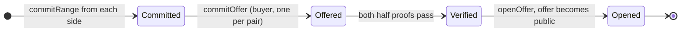

# Proposal: move all verification and all private values onto Midnight

## 1. As I understand the current design

Each user approves a structured intent. The private field is the price limit: `buyerMax` for the buyer and `sellerMin` for the seller. The other agent never receives the counterpart's limit.

The backend receives both limits. It checks that they overlap, runs the two agents on public terms only, and gets back one `proposedPrice`. A proof server that we run then builds a proof that `sellerMin <= proposedPrice <= buyerMax`, and Midnight verifies it. There is exactly one proposal and no retry, so nobody can probe the limit through repeated accept and reject.



If I read the PRD correctly, the privacy it promises is: the two limits do not reach the other agent and do not appear on the public ledger. The backend and the AI provider are trusted (section 5).

## 2. Where I think we are not using Midnight in full capacity

The two questions that define a deal, "do these ranges overlap" and "at what price", are answered on the backend before Midnight is called. Both limits are already inside our process. Midnight then confirms an inequality that the server already knows is true.

That confirmation is correct, but a server holding both numbers can return `true` without a proof. The chain adds a receipt on top of a decision the server made. The trust boundary of the product stays on the server.

It also leaves the data in the wrong place. Every range that ever entered the system sits in the backend. Every failed match sits in the backend. If the database or the logs are read, the limits are exposed, even though the ledger itself stays clean.

## 3. What I propose

Move all verification and all private values onto Midnight. The frontend and backend execute what Midnight has already accepted, and nothing else.

The core idea: never compare the two limits directly. Put one committed offer in the middle and let each side prove only its own half.

- Buyer proves `offer <= buyerMax` against their own commitment.
- Seller proves `offer >= sellerMin` against their own commitment.
- Both proofs also prove that they are talking about the same `offer`, by opening the same public `C_offer`.

If both halves pass, `sellerMin <= offer <= buyerMax` holds, which already implies the ranges overlap. No party and no server ever holds both limits at the same time.

**Midnight decides.** It stores commitments, verifies the two half proofs, moves the state, and publishes the offer at open.

**User side proves.** Each user, through their wallet or their own agent, holds their own limit and salt and sends commits and proofs directly to the contract. Limits never travel through `/api`.

**Frontend and backend execute.** They index the ledger. When a pair reaches `Opened`, they mark the order filled and show the fill price. When a transaction reverts or a timeout passes, they release the order.

**Reveal only at settlement.** The offer becomes public only after both halves have passed and the trade is going to be paid. Before that, the ledger holds three hashes and two flags.

**No range and no failed auction in the application.** `buyerMax`, `sellerMin`, the offer before open, and every salt never enter an API request or the database. A failed offer is never opened, so its price never lands in a table. The application keeps only: who is paired with whom, item, quantity, currency, status, transaction references, and the fill price after open.



Contract state as the backend sees it:



A failed half proof reverts the transaction. The ledger does not change. The app marks the pair released after a timeout.

A worked example with `buyerMax = 1,000,000`, `sellerMin = 800,000`, `offer = 900,000`:

```text
ledger after commits:   C_buyer = H(1,000,000 || s_b)   C_seller = H(800,000 || s_s)   C_offer = H(900,000 || s_o)
buyer half:             H(1,000,000 || s_b) == C_buyer,  H(900,000 || s_o) == C_offer,  900,000 <= 1,000,000   pass
seller half:            H(800,000 || s_s) == C_seller,   H(900,000 || s_o) == C_offer,  900,000 >= 800,000     pass
open:                   H(900,000 || s_o) == C_offer  ->  fillPrice = 900,000 on ledger

if ranges do not overlap (buyerMax = 700,000, sellerMin = 800,000):
  any offer that passes the buyer half is <= 700,000, so the seller half always fails.
  nothing is opened, nothing is stored, the buyer learns only "no".
```

## 4. Why there is no range overlap check

I first wanted a separate "ranges overlap, then lock" step before the offer. I now think we should not have one, for two reasons.

**It needs a prover that holds both limits.** A proof of `buyerMax >= sellerMin` must be built by someone who knows both values. Neither user does. So either the backend does it (which is the current design) or one agent receives the other's limit. Both break the goal.

**Every overlap answer leaks one bit, and the check is cheap to repeat.** Whoever asks "do we overlap" learns whether the counterpart's limit is above or below their own. With several wallets, that becomes a binary search:

```text
attacker (buyer) wants sellerMin, creates wallets with different maxes
max 150 -> overlap      min <= 150
max 100 -> no overlap   min >  100
max 125 -> overlap      min <= 125
max 112 -> no overlap   min >  112
max 118 -> overlap      min <= 118
max 115 -> no overlap   min >  115
max 116 -> no overlap   min >  116
max 117 -> overlap      min == 117
then offer exactly 117 from a fresh wallet
```

A "no re-offer to the same counterpart" rule does not stop this, because each probe is a new wallet. The more we make overlap checking a first-class, cheap operation (for example a marketplace view of "who is in my range"), the worse this gets.

The offer step already leaks one bit per attempt (accepted or not). That is the same bit the overlap check would leak, but it costs a real commit and a deposit. So the offer step should be the only place where a comparison against the counterpart happens.

## 5. Rules the contract enforces against probing

1. One range commit per `(wallet, item)`.
2. One offer per `(buyer wallet, seller wallet, item)`. If it fails, that pair is closed.
3. `commitOffer` is only accepted after both range commits exist.
4. A small deposit on commit, locked for a fixed period. Probing with many wallets has to cost something.
5. Retrying with a new value is allowed only against a different counterpart.

What remains: one bit per offer, paid for with a deposit. Comparing two limits with nobody holding both is an MPC problem and out of scope for the hackathon.

## 6. Discovery without comparison (Phase 2, optional)

If we want several buyers and sellers per item and a view of "who is relevant to me", we should not compute exact overlap. Instead each user proves, alone, that their limit falls in a coarse band and publishes only the band.

```text
seller: C_seller = H(100 || s), proof "opening is in [100, 110)"   ->  ledger shows band [100, 110)
buyer:  C_buyer  = H(120 || s), proof "opening is in [120, 130)"   ->  ledger shows band [120, 130)
market view: seller band low 100 <= buyer band high 130  ->  shown as relevant
```

This is a single-witness proof, so it has no two-party problem, and the leak is a band width that the user chooses. It is the `band_id` idea from the earlier PRD. The MVP does not need it. The demo runs one fixed buyer and one fixed seller.

## 7. Where each value lives

| Value | Current PRD | Proposed |
|---|---|---|
| `buyerMax`, `sellerMin` | backend DB, proof server, ledger as commitment | user side and ledger as commitment only |
| overlap decision | backend | implied by both half proofs passing on Midnight |
| `proposedPrice` / offer | backend chooses it, then proves it | buyer side commits it, each side proves its own half |
| fill price after open | backend, ledger per disclosure agreement | ledger at open, then backend as the fill price |
| failed match | backend as `no_match` or `verification_failed`, limits still stored | reverted transaction, nothing stored |
| salts | proof server | user side only |

## 8. What this changes for the team

- Backend: stops holding limits and forming the proposal. Becomes an indexer of ledger state and an executor of orders, plus a timeout that marks pairs released.
- Frontend: submits commits and proofs through the wallet or the user's own agent, not through `/api`. The buyer agent sends the offer opening to the seller agent over the A2A channel.
- Compact: five circuits, `commitRange`, `commitOffer`, `verifyBuyerSide`, `verifySellerSide`, `openOffer`. State `Committed`, `Offered`, `Verified`, `Opened`.
- PRD section 5: "trusted backend holds both limits and builds the proof" becomes "each user side proves its own half, the backend never receives a limit".
- PRD section 6, steps 5 to 7: "agent forms one proposal, backend checks it, prover builds proof" becomes "buyer side commits one offer, both sides prove their half, open".
- PRD section 8: one statement proved by one prover becomes two statements, each proved by its owner.
- PRD section 10: `POST /api/executions` carries no limits. Status gains `offered`, `verified`, `opened`, `released`.
- The one-offer limit is keyed to `(buyer, seller, item)` instead of per execution.

## 9. What I am asking

Can we agree on three things?

1. Midnight is the verifier and the application is the executor.
2. There is no range overlap check. The single committed offer is the only point of comparison.
3. Limits, salts, and failed offers never enter the backend.

If yes, I will write the Compact spec for the five circuits above, and we update PRD sections 5, 6, 8, and 10 together.
