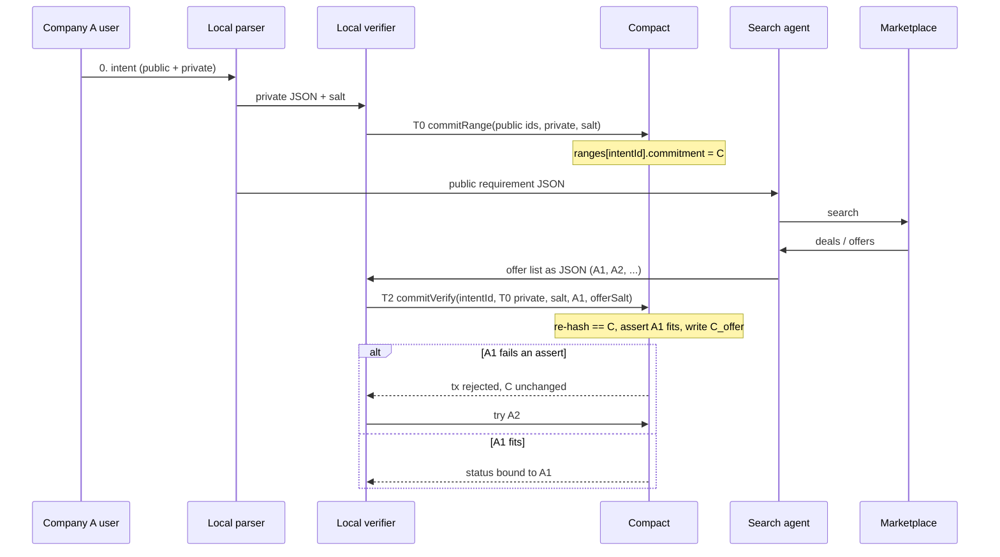

# Marketplace search + local Midnight verify

Date: 2026-09-21
Hackathon: Midnight Korea 2026
Status: locked product architecture (this file is SSOT for the flow)
Our role: Compact contract only
Working sketch (teammate-facing terms): `docs/superpowers/diagrams/intent_01_hash-and-prove.excalidraw`
Contract figure (same actors and 1-6 labels as 01): `docs/superpowers/diagrams/intent_02_t0-search-verify.png`

T0 / T1 / T2 in this document are architecture-time labels only. Figures use the 01 words: `commitRange`, `offer/deal`, `commitVerify`, `Verified`.

The Compact interface is [2026-09-18-intent-compact.md](./2026-09-18-intent-compact.md), amended 2026-09-21 to this flow. `contract/src/intent.compact` is the reference implementation. Phase 2 rows from the 2026-09-18 table stay listed OPEN in that spec.

## 1. One sentence

Company A locks private criteria on Midnight at T0. A search agent gathers offers from an open marketplace and never sees those criteria. A local verifier proves that a chosen offer opens the T0 commitment and fits it, and writes a new offer commitment.

## 2. What is locked

- The search agent does not match another company’s agent. It searches an open marketplace (for example Alibaba B2B), turns deals into JSON, and hands that JSON to the local verifier.
- Private criteria (budget / price per qty, source, delivery date) never enter a cloud LLM, the marketplace API, or the application database in plaintext.
- T0 commit is a policy lock. It is not a search key. The agent can search without `C`.
- T2 verify is the only Midnight call after T0. The local script re-supplies the T0 preimage, proves the chosen offer (A1) sits inside that lock, and commits `C_offer`.
- Midnight is the verifier of the lock and the fit. The frontend and backend only read ledger status and execute the 발주서.
- This team implements Compact. Intent parsing, marketplace MCP, and the local JSON store are other owners. They consume the circuit interface in section 8.

## 3. Actors and trust

| Actor | Where | May see | Must not see | Midnight |
|---|---|---|---|---|
| Local parser | Company A machine | Full intent, then the split JSON | — | No |
| Local verifier (script / wallet) | Company A machine | Private criteria, salt, offer JSON | — | Yes: T0 and T2 |
| Search agent | Non-local / off-chain | Public requirement, marketplace offers | Private criteria, salt, `C` preimage | No |
| Marketplace | External | Public requirement | Private criteria | No |
| Backend / indexer | Off-chain | Tx hash, public fields, `status` | Preimage | Read ledger only |
| Ledger | On-chain | `C`, `C_offer`, public item fields, `status` | Preimage until an explicit open | Stores commitments |

`C` in a local DB is allowed. That is the hash, not the budget.

## 4. Public / private split (T0 input)

The local parser emits one JSON and subtracts the private object.

```
public  = requirement minus private
private = price per qty (cap), source, delivery date, salt
```

Only `public` is given to the search agent. Field names and marketplace schema are the agent owner’s problem. Compact needs a fixed encoding of `private` (section 8).

## 5. Flow



### T0 — lock

Local verifier calls `commitRange`. Ledger stores one `C` for this wallet and item.

```
C = persistentCommit([1, priceMax, sourceId, dateMax], salt)
```

After this, a different price, source, or date is a different `C`. The old `intentId` cannot be overwritten.

### T1 — search (no Midnight)

Search agent uses only public fields. It returns structured offers. Offer prices are the market’s numbers. That is not Company A’s budget.

### T2 — verify one option

Local verifier loads the T0 preimage from local storage (not from the agent) and the chosen offer A1.

One transaction proves:

1. `rangeCommitment(priceMax, sourceId, dateMax, salt) == C` already on the ledger
2. A1 satisfies those fields (price, source, date; zero source/date means unconstrained)
3. `C_offer = offerCommitment(A1, offerSalt)` is written

Fail: assert, revert, ledger unchanged, try the next offer. Success: this intent is bound to A1.

## 6. Why T0 is before search

T0 is the envelope seal. T2 is not allowed to invent a new cap after Alibaba prices are visible. If you only commit at stamp time, the proof only says “this PO matches a budget we stated now.”

The agent does not need `C` to search. T0 is not for the LLM. It is so T2 must reuse the older lock.

## 7. State

`Committed` means the T0 row exists. It is not a pair status.

| Ledger | Meaning |
|---|---|
| `ranges[intentId].commitment = C` | T0 lock exists |
| no offer row | Search may still be running |
| `offers[intentId].status = Verified` + `C_offer` | A1 fitted and is bound to `C` |
| tx rejected | That offer did not fit. No row. `C` stays |

`Opened` / public `fillPrice` is optional for the demo. If the 발주서 only needs a Midnight tx hash of `Bound`, do not disclose the price. If the stamp must show the filled price, add `openOffer` later and `disclose` only then.

## 8. Compact interface

See [2026-09-18-intent-compact.md](./2026-09-18-intent-compact.md). Circuit names match the figures:

| Circuit | When | Private inputs | Effect |
|---|---|---|---|
| `rangeCommitment` (pure) | helper | `priceMax`, `sourceId`, `dateMax`, `salt` | domain-tagged commit, tag `1` |
| `offerCommitment` (pure) | helper | offer fields, `offerSalt` | domain-tagged commit, tag `2` |
| `commitRange` | T0 | criteria + salt | insert `C`; one lock per wallet per item |
| `commitVerify` | T2 | T0 criteria + salt + A1 + `offerSalt` | re-hash == `C`, assert fit, insert `C_offer` |

Zero `sourceId` or `dateMax` means unconstrained at verify. Those zeros stay inside `C`.

Encoding: `priceMax` / offer price `Uint<64>` KRW; `sourceId` `Bytes<32>`; `dateMax` / offer date `Uint<32>` unix day; salts `Bytes<32>`.

## 9. What we do not build

- Local intent → JSON parser (cheap local model)
- Search agent, Qwen MCP, Alibaba API
- Backend timeout / 발주서 PDF
- Deposit, on-chain release, band discovery (still Phase 2 from 2026-09-18 §13)

## 10. Handoff

1. After the user approves the split JSON, the local verifier calls `commitRange`. Backend gets the tx hash and the public fields only.
2. Search agent receives public JSON only. It returns an offer list as JSON.
3. Local verifier picks A1 (or tries in order), calls `commitVerify` with T0 secrets from local storage.
4. Hash string ids with SHA-256 to `Bytes<32>` before every call. Backend keeps the mapping.
5. Compute commitments with the generated `pureCircuits`, never by hand.
6. UI reads `offers[intentId].status`.

## 11. OPEN

- Exact offer JSON schema from the marketplace agent
- First success binds one `intentId` (this amend). Several simultaneous fitted offers would need a new key.
- Whether `Opened` / public fill price is in a later demo (Phase 2 in 2026-09-18 §13)
- Seller-side Midnight wallet if a counterparty later joins (Phase 2 A2A pair)
